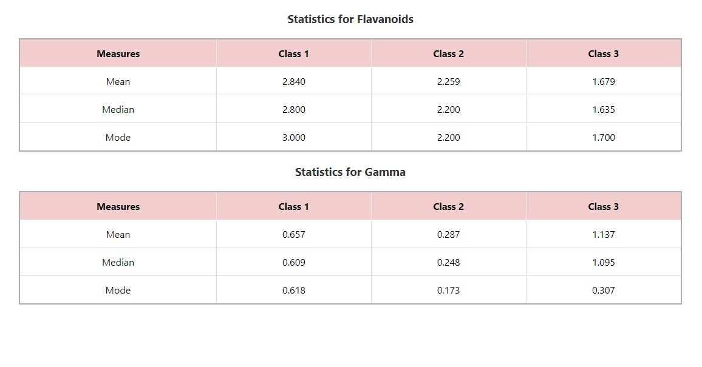

This is a simple React project that calculates statistical measures (mean, median, and mode) for data stored in a JSON file. 

The project is built using React and calculates statistics for two different parameters: flavanoid and gamma. The results are displayed in tables using React components.

 The project structure includes files like wine-data.json for dataset, statisticsCalculations.js with functions for statistical calculations, and StatisticsTable.js for displaying the results. 
 
 The main application in App.js imports these components to display the statistics tables. 
 
 To run this project, clone the repository to your local machine, navigate to the project directory.

 
Install dependencies using Yarn (yarn install). 

Start the development server with yarn start,
and open your web browser to http://localhost:3000 to view the calculated statistics tables for the flavanoid and gamma parameters.

Screenshot 

